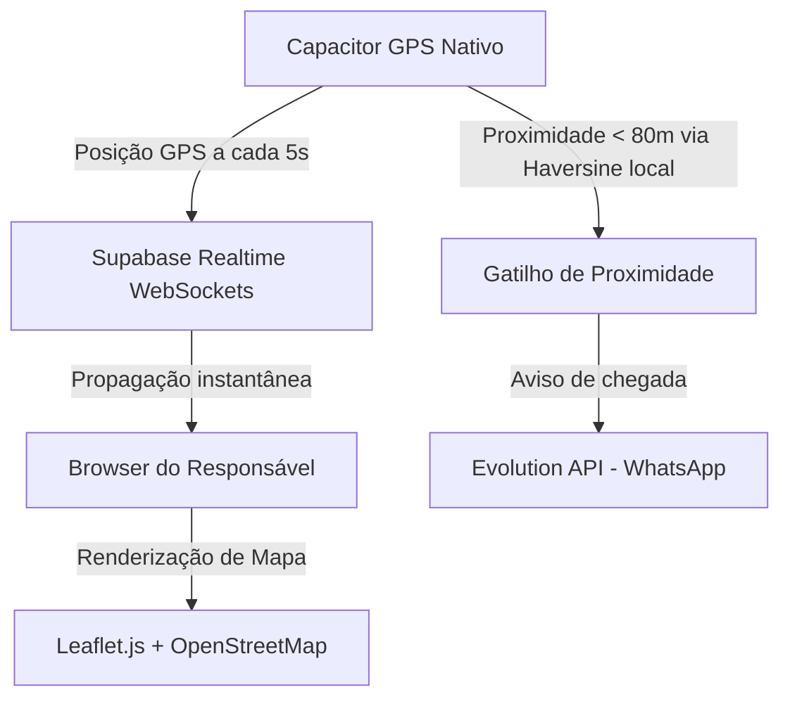

# Planejamento Estratégico: Rotas de Passageiros (Versão 2.0)

Este documento descreve as diretrizes, tecnologias e arquitetura de negócios planejadas para a evolução do módulo de **Rotas de Passageiros e Rastreamento (Versão 2.0)** no ecossistema **Van360**.

---

## 🎯 Visão Geral da V2.0

Enquanto a V1.0 focou na precisão cirúrgica de deep linking curva a curva (Waze e Google Maps), avanço manual resiliente perna-a-perna do motorista e envio de WhatsApps baseados no sequenciamento da fila a **custo recorrente zero de APIs de mapa**, a **Versão 2.0** tem como foco a **experiência em tempo real para as famílias e automação por presença geográfica**.

---

## 🚀 Funcionalidades Mapeadas para a V2.0

### 1. Link Público de Rastreamento em Tempo Real (Pais)
*   **A Experiência:** O pai/responsável recebe um link no WhatsApp no momento em que a van inicia a rota (ou quando a criança se torna a parada ativa) e pode visualizar em tempo real o ícone do veículo se movendo em direção à sua casa ou escola.
*   **A Blindagem de Custo (Margem de Lucro SaaS):**
    *   **Proibido:** Uso de Google Maps JavaScript API (custa muito caro por requisição de Tiles e travará financeiramente a viabilidade do plano mensal dos motoristas).
    *   **Solução Proposta:** **Leaflet.js + OpenStreetMap (OSM)**. Leaflet é uma biblioteca open-source de alta performance e os Tiles do OpenStreetMap são **100% gratuitos**, permitindo renderizar o mapa do trajeto para o pai sem gastar R$ 0,00 de licenças.
*   **Tecnologia de Transporte:** **Supabase Realtime (WebSockets)**. O aplicativo Capacitor do motorista envia pequenas coordenadas de GPS de tempos em tempos (ex: a cada 5 segundos) para uma tabela de "posicao_motorista". O Supabase Realtime propaga essa posição para a tela do pai aberta no navegador via WebSocket de forma instantânea e com consumo de rede irrelevante.

### 2. Geofencing Mobile Ativo Local (Automação de Parada)
*   **A Experiência:** O motorista não precisará clicar em "Cheguei à porta". O celular fixado no suporte detectará a proximidade automaticamente e disparará o WhatsApp para o responsável.
*   **Como Funciona:** O aplicativo local mobile Capacitor rodando em primeiro plano lê as coordenadas de GPS do celular e calcula **offline** (usando a **Fórmula de Haversine** localmente na CPU do aparelho) a distância em linha reta até a parada ativa.
*   **O Gatilho:** Quando a distância for menor que **80 metros**, o aplicativo emite um alerta sonoro/vibratório para o motorista, mostra em destaque *"Você chegou!"* e dispara silenciosamente um evento de API para o backend avisar os pais via WhatsApp.
*   **Custo:** **R$ 0,00**, pois todo o processamento de proximidade é feito de forma nativa e offline no chip de GPS e CPU do próprio smartphone do motorista.

### 3. Matriz de Distância e Otimização Sequencial Automática
*   **A Experiência:** Ao criar uma rota com 15 passageiros espalhados por diferentes ruas, o motorista não precisará ordenar a sequência de paradas manualmente. O sistema sugere o trajeto de menor tempo ou menor quilometragem de forma inteligente com um clique.
*   **Tecnologia Proposta:** Uso pontual do **Google Distance Matrix API** ou serviços livres como o **OSRM (Open Source Routing Machine)**. Por rodar apenas no momento do cadastro ou reordenação (e não repetidamente durante as corridas), o consumo cabe perfeitamente na cota mensal de franquia do plano de desenvolvedor.

---

## 🗄️ Arquitetura do Banco de Dados Pronta (Preparação de Terreno)

A modelagem de tabelas implementada na V1.0 já foi estruturada pensando no suporte de dados da V2.0:
*   A tabela `passageiros` já possui as colunas `latitude` e `longitude` persistidas no banco.
*   A tabela `execucoes_rota_passageiros` possui timestamps de `notificado_em` e `visitado_em` para histórico, relatórios de pontualidade e auditoria de presença.

---

## 🛡️ Pilares Tecnológicos Recomendados para a V2.0

